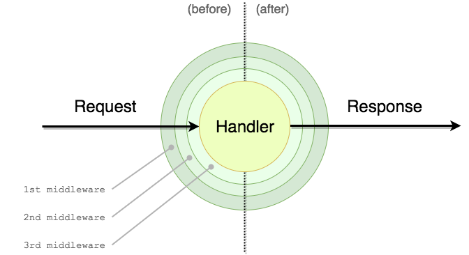

# Middizure

This middleware allows you to add before and after hooks to your handlers. It currently supports azure handler only.

A middleware engine allows you to focus on the strict business logic of your Lambda and then attach additional common elements like authentication, authorization, validation, serialization, etc. in a modular and reusable way by decorating the main business logic.

This was heavily insipired by:
- API: https://github.com/middyjs/middy
- Code: https://medium.com/@uday.rayala/how-to-create-your-own-aws-lambda-middleware-framework-in-node-js-e65f23bc0ac
- Vision: https://github.com/serverless/multicloud

## Quick Example

```
const { 
    withMiddleware,
    checkToken,
    checkUser,
    setContentType,
    database,
 } = require('foundation-utils/middleware');
 const databaseService = require('../database');


const handler = async (contex, req) => {
    const { checkToken, checkUser, database } = context.middleware;

    context.res.body = {
        message: `
        Hi, I am user ${checkUser.user.email} and my decoded token is ${checkToken.decodedToken}.
        Im also connected to the database ${database}
        `
    }
}


module.exports = withMiddleware(handler, [
    database(),
    checkToken(),
    checkUser(),
    setContentType({
        contentType: 'application/json',
    })
])
```

Example Middleware

```
const logger = require('../logger');

const logMiddleware = (options = {}) => ({
    before: async ({ context, req }, next) => {
        logger.init({ consoleLog: context.log, cloudEnv: process.env.CLOUD });
        logger.info('middleware::log::before', {
            headers: {
                ...req.headers,
                Authorization: Boolean(req.headers.Authorization),
                authorization: Boolean(req.headers.authorization),
            },
            query: req.query,
            params: req.params,
            body: req.body,
        });
        return next({ context, req });
    },
    after: async ({ context, req, result }, next) => {
    logger.info('middleware::log::after', result);
        return next({ context, req, result });
    },
});
```

# Usage

As you might have already seen from our first example here, using middizure is very simple and requires just few steps:

- Write your Lambda handlers as usual, focusing mostly on implementing the bare business logic for them.
- Import  and all the middlewares you want to use.
- Wrap your handler with withMiddleware function this function accepts and array of middlewares `withMiddleware([ somemiddleware() ])`
- The resulting function is an onion of function middlewares that wrap your handler and follows the specific environment (cloud) function signature

```
const { withMiddleware } = require('foundation-utils/middleware')
const middleware1 = require('sample-middleware1')
const middleware2 = require('sample-middleware2')
const middleware3 = require('sample-middleware3')

const originalHandler = (context, req) => {
  /* your business logic */
}


module.exports = withMiddleware([
    middleware1(),
    middleware2(),
    middleware3(),
])
```

# How it works

Middizure implements the classic onion-like middleware pattern, with some peculiar details.



When you attach a new middleware this will wrap the business logic contained in the handler in two separate steps.

When another middleware is attached this will wrap the handler again and it will be wrapped by all the previously added middlewares in order, creating multiple layers for interacting with the request (event) and the response.

This way the request-response cycle flows through all the middlewares, the handler and all the middlewares again, giving the opportunity within every step to modify or enrich the current request, context, or the response.

## Execution order

Middlewares have two phases: before and after.

The before phase, happens before the handler is executed. In this code the response is not created yet, so you will have access only to the request.

The after phase, happens after the handler is executed. In this code you will have access to both the request and the response.

If you have three middlewares attached (as in the image above), this is the expected order of execution:

    middleware1 (before)
    middleware2 (before)
    middleware3 (before)
    handler
    middleware3 (after)
    middleware2 (after)
    middleware1 (after)

Notice that in the after phase, middlewares are executed in inverted order, this way the first handler attached is the one with the highest priority as it will be the first able to change the request and last able to modify the response before it gets sent to the user.

## Handling Errors

Handlers or middlewares that throw errors that are not catch will terminate the function and azure will return 500 with no body

TODO: Add error handling support to middlewares
TODO: Catch error and return them gracefully if possible

## Writing a middleware

```
# myMiddleware.js

const myMiddleware = (config) => {
  // might set default options in config
  return ({
    before: async ({ context, req }, next) => {
      // might read options from `config`
      next({ context, req })
    },
    after: async ({ context, req, result }, next) => {
      // might read options from `config`
      next({ context, req, result })
    },
  })
}

module.exports = myMiddleware
```
Caveats:
- Before and after function need to return a promise or be async. 
- next needs to be called with the appropiate parameters depending if its a before or after
- after has an extra variable called result, this is the result from the handler and can be updated but not reassing since it will lose reference

## Usage with apollo-server-azure-functions

The middleware can be used with apollo and it will fire before and after the execution of the apollo server. Middizure by default expects the handler to return a promise but apollo server azure uses the context object to terminate the function (context.done). You can pass a parameter (useCallback) to middizure to indicate to expect a callback instead

```
const server = new ApolloServer({
    schema: buildFederatedSchema([
        {
            typeDefs,
            resolvers,
        },
    ]),
    context: async ({ request, context }) => {
        // you can still use the apollo context, this will run after the before middlewares
    },
});

exports.graphqlHandler = withMiddlewares(server.createHandler(), [
    databaseMiddleware({
        databaseService,
    }),
], { useCallback: true });
```
